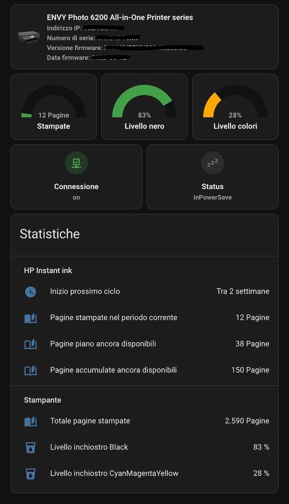

# hass-my-hp-instant-ink

Per capire un po' meglio il funzionamento di HA ho provato a cimentarmi con il mio primo progettino: un package per tener traccia dei consumi delle cartucce della stampante e dello stato dell'abbonamento ad HP Instant Ink.

A parte qualche input per definire i valori di partenza, ho sfruttato l'integrazione [REST](https://www.home-assistant.io/integrations/rest/) per leggere i dati dalle varie pagine di status della stampante e un [`utility_meter`](https://www.home-assistant.io/integrations/utility_meter/) per memorizzare i dati di consumo. 
Il resto del lavoro lo fanno dei `template` che con dei _sofisticatissimi algortimi_ 🤣 calcolano le pagine rimanenti del piano.

L'abbonamento ad HP Instant Ink prevede che ogni mese si resetti il contatore delle pagine ancora disponibili, ma la data effettiva non è il 1° bensì il giorno del mese in cui si è sottoscritto l'abbonamento (nel mio caso ad esempio il 9 di ogni mese), quindi ho impostato [`periodically_resetting: false`](https://www.home-assistant.io/integrations/utility_meter/#periodically_resetting) all'`utility_meter` e il reset lo faccio con un'automazione "triggerata" nel giorno del mese corretto. 

Magari c'era un modo più furbo per farlo, ma con le mie conoscenze attuali non sapevo come altro fare 😄 

Per comodità ho sfruttato i [Packages](https://www.home-assistant.io/docs/configuration/packages/) di HA e ho messo tutto il codice nel file [config/packages/my_hp_instant_ink.yaml](https://github.com/enricomingardo/hass-my-hp-instant-ink/blob/main/config/packages/my_hp_instant_ink.yaml).

Qui una dashboard di esempio che si può ottenere 

